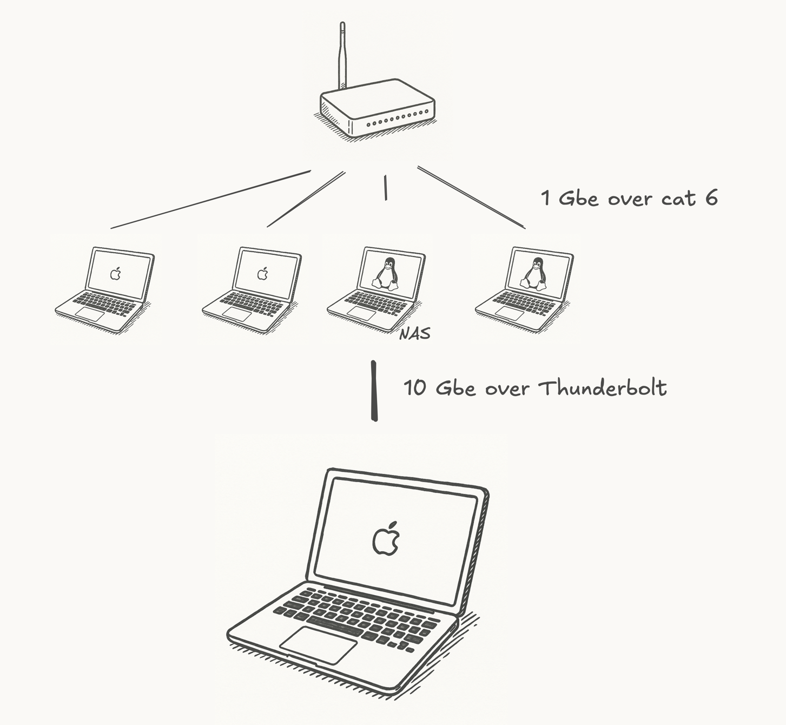
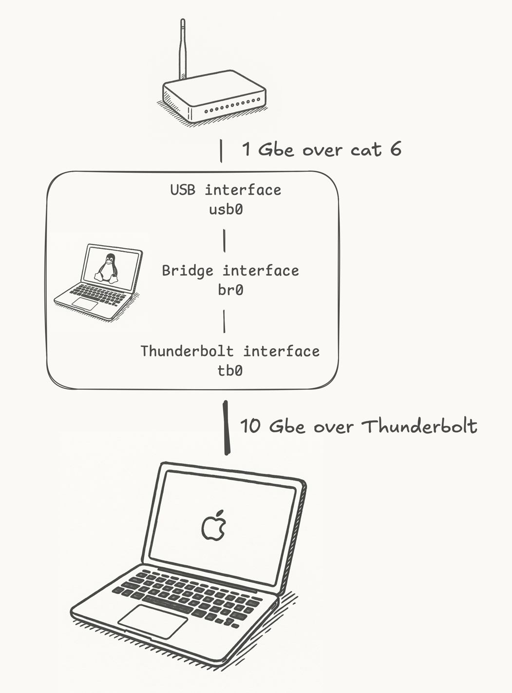
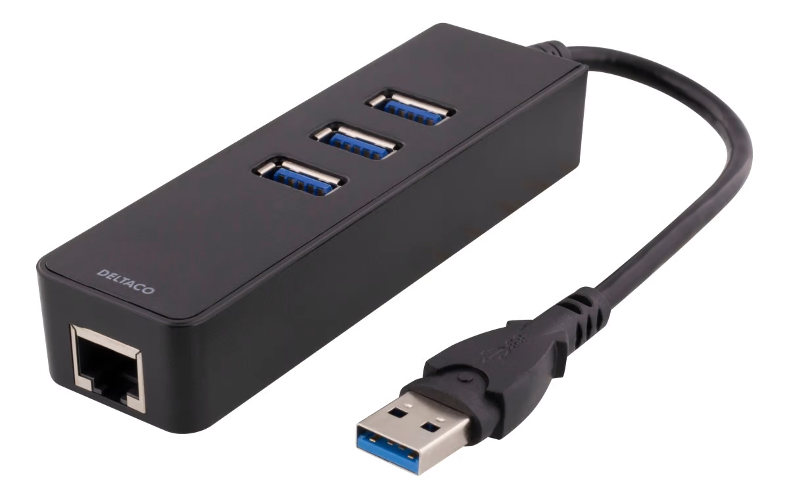
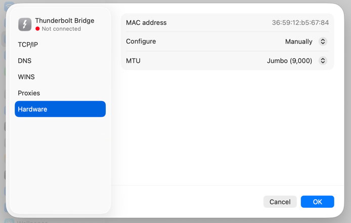

# Thunderbolt NAS bridge
## Background
10Gbps networking at home is fantastic! But also either quite expensive or often buggy (cheap interfaces and switches are prone to overheating, throttling or 
plain out failing). And pragmatically, I don't need 10Gbps between much of my gear; I primarily need a fast link between my
MacBook Pro, which I use as my main development machine, and a Dell XPS 15
9570 running Linux, that serves as file storage and hosts a few lightweight services at home.

To achieve this inexpensively—without investing in 10Gbps network equipment that would sit either idle or underutilized 99.9% of the time—I
simply have connected the MacBook directly to the XPS using a Thunderbolt 3 cable and configured a transparent network
bridge on the XPS. This setup allows the MacBook to obtain its IP address from my DHCP server and appear as a peer host on my home network
segment, with no need for NAT or other complications.

By assigning a single IP address to the bridge, the XPS becomes reachable from any host on my 
network — including the MacBook — using the same address. This avoids the inconvenience of having to use different IP addresses
for the XPS depending on whether the MacBook is connected via Wi-Fi or Thunderbolt.

### 👍 Pros
* Fast and reliable networking between two hosts
* Relatively easy to configure
* Inexpensive

### 👎 Cons
* Limited physical range
* Occupies a valuable Thunderbolt port



## Configuration files for `systemd-networkd` in this repo
The files in this repo are used to configure the network bridge on my XPS via `systemd`. This has been tested on
Ubuntu 24.04. The configuration makes for a robust setup that re-establishes the bridge correctly when the Thunderbolt
cable is reconnected or when any of the machines reboot or wake up from sleep.

The files in this repo are specific to my setup, but they should be easy to adapt to your own setup,
most importantly by editing the MAC addresses in the `[Match]` sections of the `.link` files. Run `install.sh` to copy
the files to the correct location on your system after editing the MAC addresses.

> [!NOTE]  
> If you have existing `systemd-networkd` configuration files in `/etc/system/network` or a netplan configuration file in
> `/etc/netplan`, you must verify that the files in this repo do not conflict with your existing configuration. 

If you want to experiment with this type of setup before commiting to installing the `systemd` files,
you can tweak and run `bridge.sh`. 

## Bridge topology and naming



- `usb0`: USB ethernet interface (1Gbps, MTU 1500)
- `br0`: Network bridge (MTU 9000) that bridges `tb0` and `usb0`
- `tb0`: Thunderbolt ethernet interface (10Gbps, MTU 9000)

I'm using a USB ethernet interface simply because the XPS does not have an integrated ethernet interface.
The specific one I have is from Deltaco with a Realtek RTL8153 chipset and it works just fine.



## Performance considerations on Linux
The one thing that's important to get right on the Linux side is the MTU of the interfaces. Make sure that both `tb0` and `br0` are set to
MTU 9000 (jumbo frames) to get the best performance. If this is not configured correctly, you will experience less than
10Gbps results from `iperf3` and high CPU usage caused by the `ksoftirqd` process.

> [!NOTE]
> The `thunderbolt_net` module does not implement
> [Receive Side Scaling (RSS)](https://www.kernel.org/doc/Documentation/networking/scaling.txt),
> meaning that the kernel will not automatically distribute incoming packets to multiple CPU cores. If you're seeing
> less than 10Gps performance from your Thunderbolt interface and 100% load on one CPU core caused by the `ksoftirqd`
> process even after enabling jumbo frames, this is likely the cause and there is little that can be done about it,
> apart from buying a faster CPU or trying to implement RSS in the
> [thunderbolt_net](https://github.com/torvalds/linux/tree/master/drivers/net/thunderbolt) module yourself,
> of course...

Since the `thunderbolt_net` driver handles everything in software, there isn't any point trying to optimize
offloading settings such as `tso`, `gso`, `sg`, `gro`, `lro`, `rx`, `tx` or the like on `tb0`.

## Performance considerations on macOS
Apply the settings below manually to get the best network performance for this kind of setup on macOS.

### Jumbo frames
Make sure the "Thunderbolt Bridge" interface on your Macbook is using jumbo frames (9000 MTU).



### Disable macOS TCP segmentation offload
If you notice slow network performance on macOS, disable TCP segmentation offload (TSO).

#### Immediate fix
Run:
```
sudo sysctl -w net.inet.tcp.tso=0
```

#### Permanent fix
Add this line to `/etc/sysctl.conf`: 
```
net.inet.tcp.tso=0
```

## Iperf3 results
````
oddbjorn@mac ~ % iperf3-darwin -c 10.0.0.131 -V --bidir
iperf 3.8.1 -  -- Apple version iperf3-126.0.5
Darwin mac.local 25.0.0 Darwin Kernel Version 25.0.0: Wed Sep 17 21:41:45 PDT 2025; root:xnu-12377.1.9~141/RELEASE_ARM64_T6000 arm64
Control connection MSS 8948
Time: Wed, 15 Oct 2025 11:43:40 UTC
Connecting to host 10.0.0.131, port 5201
      Cookie: mselubzztshzuvdmsjtrtvifwkefh6kqv37q
      TCP MSS: 8948 (default)
[  5] local 10.0.0.130 port 53235 connected to 10.0.0.131 port 5201
[  7] local 10.0.0.130 port 53236 connected to 10.0.0.131 port 5201
Starting Test: protocol: TCP, 1 streams, 131072 byte blocks, omitting 0 seconds, 10 second test, tos 0
[ ID][Role] Interval           Transfer     Bitrate         Retr  Cwnd          Bytes-in-     Sndwnd          RTT   Flow-   Rwnd-
                                                                                 Flight                             Ctrl    Lmtd
[  5][TX-C]   0.00-1.00   sec  1.12 GBytes  9.63 Gbits/sec    0   4.39 MBytes   2.13 MBytes   2.14 MBytes     2ms    0ms   989ms      
[  7][RX-C]   0.00-1.00   sec  1.25 GBytes  10.8 Gbits/sec  3.94 MBytes                  
[  5][TX-C]   1.00-2.00   sec  1.16 GBytes  10.0 Gbits/sec    0   4.39 MBytes   2.12 MBytes   2.12 MBytes     2ms    0ms   997ms      
[  7][RX-C]   1.00-2.00   sec  1.37 GBytes  11.8 Gbits/sec  3.99 MBytes                  
[  5][TX-C]   2.00-3.00   sec  1.16 GBytes  9.98 Gbits/sec    0   4.39 MBytes   2.06 MBytes   2.06 MBytes     2ms    0ms   997ms      
[  7][RX-C]   2.00-3.00   sec  1.37 GBytes  11.8 Gbits/sec  3.91 MBytes                  
[  5][TX-C]   3.00-4.00   sec  1.16 GBytes  9.98 Gbits/sec    0   4.39 MBytes   2.12 MBytes   2.12 MBytes     2ms    0ms   997ms      
[  7][RX-C]   3.00-4.00   sec  1.37 GBytes  11.8 Gbits/sec  3.99 MBytes                  
[  5][TX-C]   4.00-5.00   sec  1.16 GBytes  9.99 Gbits/sec    0   4.39 MBytes   2.12 MBytes   2.12 MBytes     2ms    0ms   997ms      
[  7][RX-C]   4.00-5.00   sec  1.37 GBytes  11.8 Gbits/sec  4.00 MBytes                  
[  5][TX-C]   5.00-6.00   sec  1.17 GBytes  10.0 Gbits/sec    0   4.39 MBytes   2.12 MBytes   2.12 MBytes     2ms    0ms   997ms      
[  7][RX-C]   5.00-6.00   sec  1.37 GBytes  11.8 Gbits/sec  3.91 MBytes                  
[  5][TX-C]   6.00-7.00   sec  1.16 GBytes  9.99 Gbits/sec    0   4.39 MBytes   2.12 MBytes   2.12 MBytes     2ms    0ms   996ms      
[  7][RX-C]   6.00-7.00   sec  1.38 GBytes  11.8 Gbits/sec  3.92 MBytes                  
[  5][TX-C]   7.00-8.00   sec  1.17 GBytes  10.0 Gbits/sec    0   4.39 MBytes   2.12 MBytes   2.12 MBytes     2ms    0ms   997ms      
[  7][RX-C]   7.00-8.00   sec  1.37 GBytes  11.8 Gbits/sec  3.88 MBytes                  
[  5][TX-C]   8.00-9.00   sec  1.16 GBytes  9.92 Gbits/sec    0   4.39 MBytes   2.12 MBytes   2.12 MBytes     1ms    0ms   991ms      
[  7][RX-C]   8.00-9.00   sec  1.37 GBytes  11.8 Gbits/sec  3.97 MBytes                  
[  5][TX-C]   9.00-10.00  sec  1.17 GBytes  10.0 Gbits/sec    0   4.45 MBytes   2.12 MBytes   2.12 MBytes     1ms    0ms   997ms      
[  7][RX-C]   9.00-10.00  sec  1.38 GBytes  11.8 Gbits/sec  3.98 MBytes                  
- - - - - - - - - - - - - - - - - - - - - - - - -
Test Complete. Summary Results:
[ ID][Role] Interval           Transfer     Bitrate         Retr
[  5][TX-C]   0.00-10.00  sec  11.6 GBytes  9.96 Gbits/sec    0           0.000s           9.959s             sender
[  5][TX-C]   0.00-10.00  sec  11.6 GBytes  9.96 Gbits/sec                  receiver
CPU Utilization: local/sender 48.1% (4.0%u/44.1%s), remote/receiver 65.3% (3.0%u/62.3%s)
CPU Utilization: local/receiver 48.1% (4.0%u/44.1%s), remote/sender 65.3% (3.0%u/62.3%s)
rcv_tcp_congestion cubic
[  7][RX-C]   0.00-10.00  sec  13.6 GBytes  11.7 Gbits/sec    0           0.000s           0.000s             sender
[  7][RX-C]   0.00-10.00  sec  13.6 GBytes  11.7 Gbits/sec                  receiver
snd_tcp_congestion cubic

iperf Done.
````

## Relevant links
* [Kernel documentation for USB4 and Thunderbolt](https://docs.kernel.org/admin-guide/thunderbolt.html)
* [Documentation for systemd-networkd](https://www.freedesktop.org/software/systemd/man/latest/systemd.network.html)
* https://forum.proxmox.com/threads/intel-nuc-13-pro-thunderbolt-ring-network-ceph-cluster.131107/
* https://gist.github.com/geosp/80fbd39e617b7d1d9421683df4ea224a
* https://gist.github.com/scyto/67fdc9a517faefa68f730f82d7fa3570
* https://gist.github.com/thaynes43/6135cdde0b228900d70ab49dfe386f91